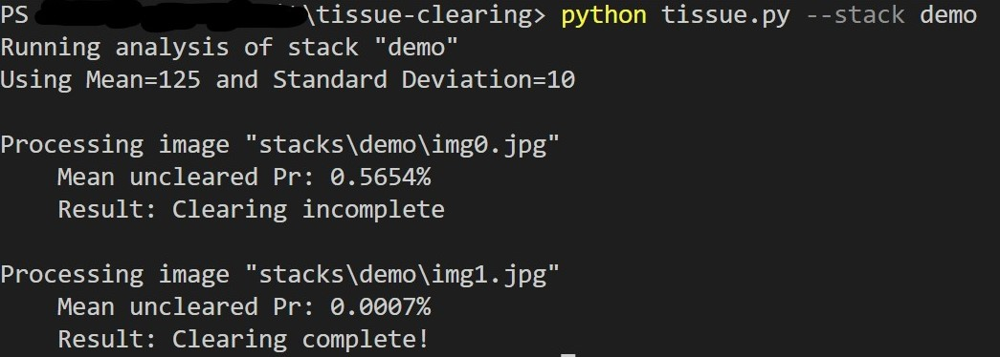
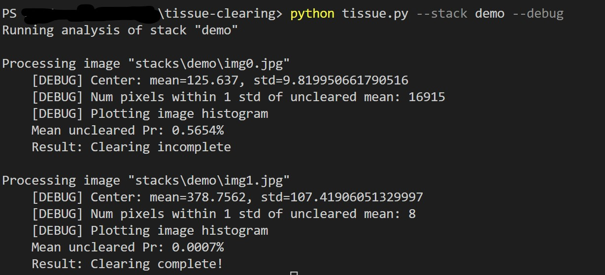

## Description:
Estimates if a tissue sample has been cleared using pixel-wise comparison with a Gaussian distribution chosen to represent the expected values of uncleared tissue. The mean and std of the distribution are estimated in advance and passed in from config.yaml, along with background filter and acceptance thresholds. 

## Usage:
From root:

    python tissue.py --stack [Stack] [--debug]

## Parameters:
 * Stack: name of image folder within /stacks
 * Debug: Optional verbose data on raw image

    * Data distribution at center
    * Number of points within 1 std of mean
    * Histogram of raw image brightness

## Examples:
### Simple:

### Debug:
